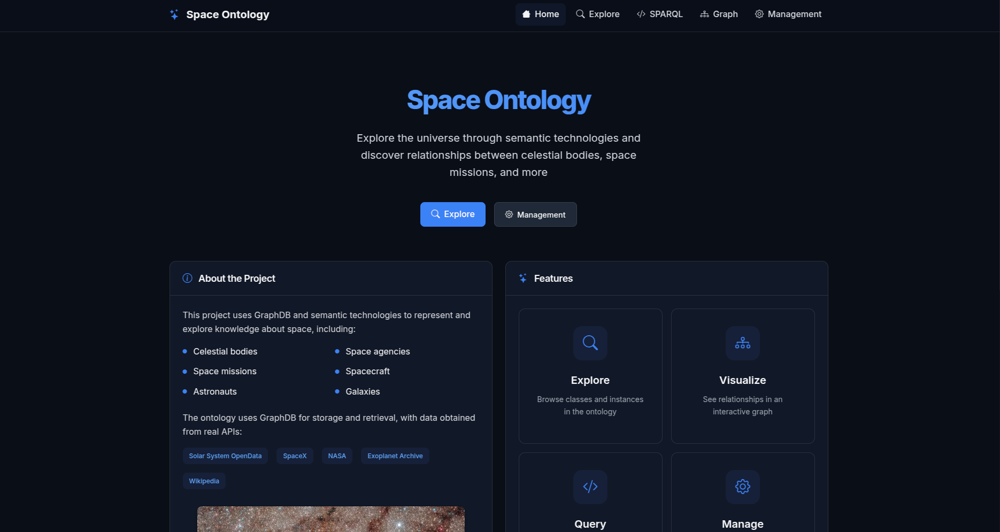
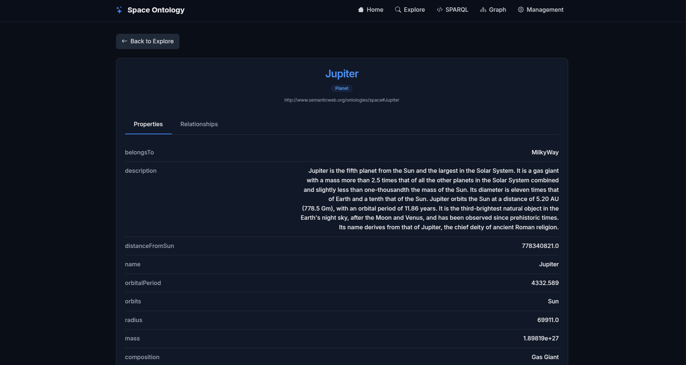
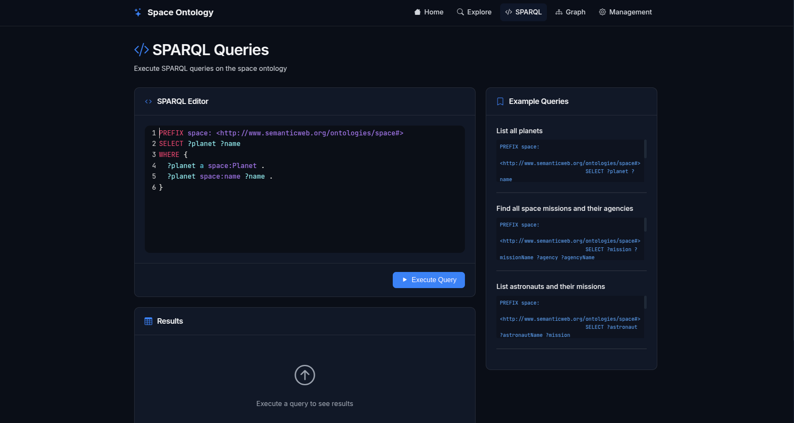

# RPCW_TP

This project is part of the RPCW (Representation and Processing of Knowledge on the Web) course. It focuses on creating and managing an ontology-based system for representing and querying data related to space exploration. The system uses RDF and OWL standards to define and query relationships between entities such as astronauts, space missions, celestial bodies, and more.

---

## Table of Contents

1. [Features](#features)
2. [Pages Overview](#pages-overview)
3. [Dependencies](#dependencies)
4. [How to Run](#how-to-run)
5. [Authors](#authors)

---

## Features

- **Ontology Management**:

  - Create and manage an ontology structure for space exploration.
  - Define classes, properties, and relationships between entities.

- **SPARQL Query Execution**:

  - Execute SPARQL queries to retrieve data from the ontology.

- **Graph Visualization**:

  - Generate graph data for visualizing relationships between entities.

- **Entity Search**:

  - Search for entities (e.g., astronauts, missions) by name.

- **Statistics**:
  - Retrieve statistics about the ontology, such as the number of classes, properties, and triples.

### Pages Overview

Below are brief descriptions of each page developed together with a screenshot:

1. **Home Page**  
   Overview of the application and its features.
   

2. **Explore Page**  
   Explore the ontology visually, navigating through classes, properties, and relationships between entities. Not only that but see statistics about the ontology like how many triples it has, etc.
   

3. **Entity Page**  
   View detailed information about a specific entity, including its properties, relationships, and associated data within the ontology.
   

4. **SPARQL Query Page**  
   Execute SPARQL queries and view results.
   

5. **Graph Page**  
   Visualize the ontology as an interactive graph, showcasing entities and their relationships.
   
   

6. **Settings Page**  
   Allows users to configure the application's persistence settings. Users can select the ontology file path and choose between using a local file or a GraphDB repository for storing the ontology.
   

---

## Dependencies

The project dependencies are listed in the `requirements.txt` file. To install them, run the following command:

```bash
pip install -r requirements.txt
```

## How to Run

To start the application, simply run the `run.py` script using Python:

```bash
python3 run.py
```

## Authors

- [**João Coelho: PG55954**](https://github.com/JoaoCoelho2003)
- [**Mariana Silva: PG55980**](https://github.com/MarianaSilva659)
- [**José Rodrigues: PG55969**](https://github.com/FilipeR13)
